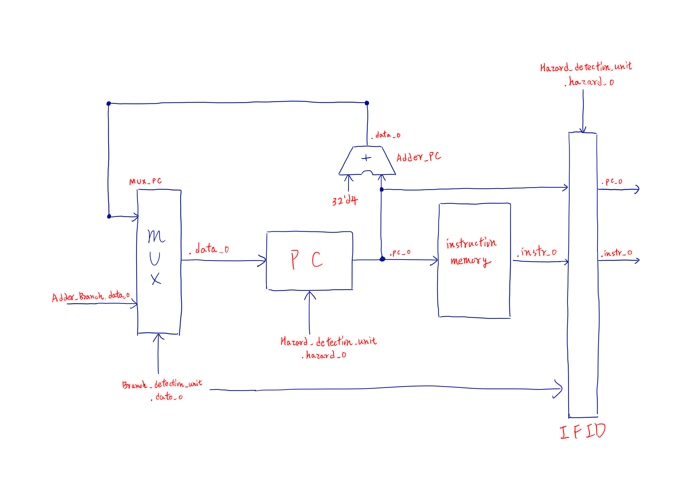
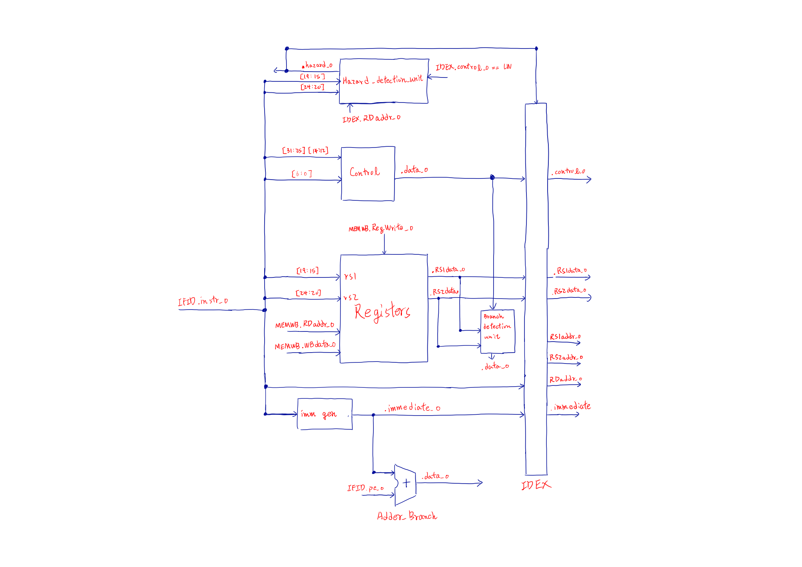
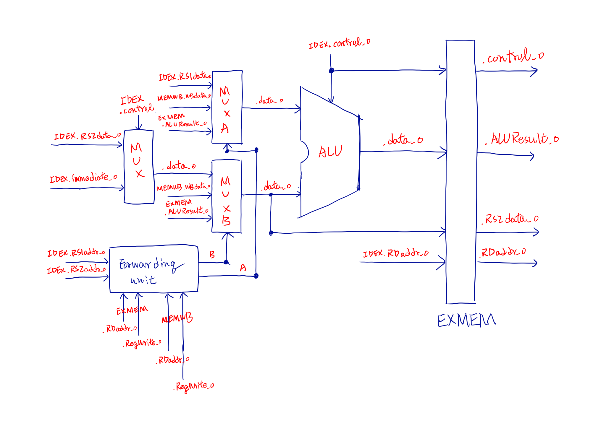
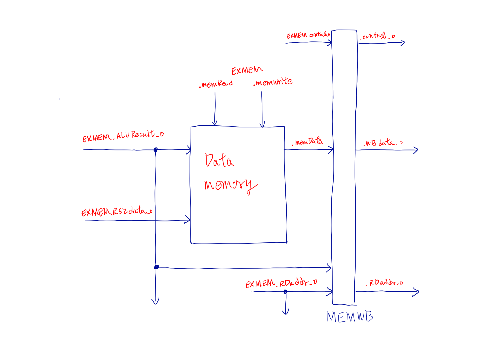

---
export_on_save:
  phantomjs: "pdf"
---
# Computer Architecture 2018 Fall

莊翔旭（100%） 簡宗佑(0%) 黃國軒(0%)

## How do you implement this Pipelined CPU

### IF

這部分和 hw4 差不多，主要多了 IFID pipeline unit 來傳遞資料

<!-- pagebreak -->
### ID

* hazard detection unit : 用來檢測是否產生 hazard
* branch detection unit : 用來檢測 branch 是否成真
* immediate generator   : 產生 immediate
* IDEX pipeline unit    : 傳遞資料給 EX step

### EX

* forwarding mux        : 依據 forwarding unit 的訊號將資料導向
* forwarding unit       : 判斷是否需要 forwarding data
* EXMEM pipeline unit   : 傳遞資料給 MEM step

<!-- pagebreak -->
### EX && WB

這部分也和 hw4 沒什麼差別，多了 MEMWB pipeline unit 傳遞資料和判斷 WB data (將 mux 整合進 MEMWB pipeline 裡)

## Problems and solution of this project.

### 1. data's 0,1,x,z state

verilog 裡面 case 在筆對的時候對比對 x state 的 bit, 但 == 只會比對 0,1 state，在某些場合會需要忽略 x state, 但我用 case 去比對，就會出錯。

最後解法就是用 casez 或 casex 去忽略 x,z state
